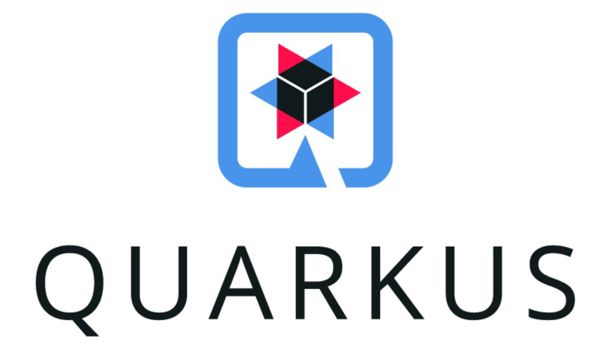

# java-quarkus

> Ejemplo de proyecto de java 17 con quarkus




## :gear: Requisitos

* openjdk 17
* Apache Maven 3.8.4 

## :tada: Uso

```bash

# correr usando dev
make r

# compilar a binario
make p
```

## :books: Referencias

* [Iconos](https://github.com/ikatyang/emoji-cheat-sheet/blob/master/README.md)
* [Readme de quarkus](docs/README.md)

## :grin: Autor

> **Brian Lobo**

* Github: [brianwolf](https://github.com/brianwolf)
* Docker Hub:  [brianwolf94](https://hub.docker.com/u/brianwolf94)
